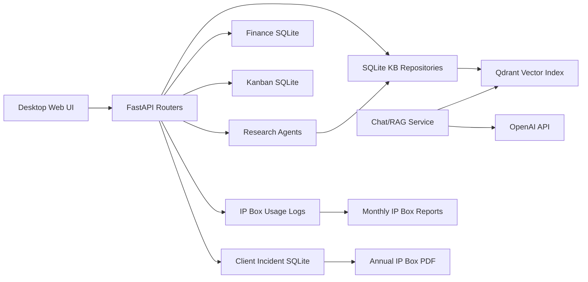

# Technical Architecture

## High-Level Architecture

## Implemented Blocks

- Desktop UI: local browser UI served by FastAPI.
- Client selector: application state stores active client.
- Knowledge Base Layer: SQLite KB items with Standard and client scopes.
- Vector Search: Qdrant collection `kb_standard` and per-client collections.
- AI Orchestration: embedding and chat response generation using OpenAI API.
- Incident Registration: client-isolated incident SQLite databases.
- Evidence Attachments: file/link/note evidence with SHA256 for files.
- Research Agent Pipeline: Topic Scout, Collector, Normalizer, Auditor, Ingestor, Indexer.
- Export/Reporting: annual incident PDF dossier and monthly IP Box usage report module.

## Partially Implemented or Planned

- Feedback Engine: not implemented as a formal scoring workflow; advisor documentation treats it as planned/TBC.
- Accuracy Scoring Engine: not implemented as a formal module; usage logs include optional `accuracy_score`.
- UI Usage Logging: backend module exists; UI integration remains a planned step.

## Query Flow

1. User selects scope: general, client or client plus standard.
2. User asks a SAP IS-U question.
3. The question is embedded.
4. Qdrant retrieves permitted KB items.
5. Chat service builds an ancliar with source/audit information.
6. Optional usage logging records the query hash, response hash, retrieval counts and contribution fields.

## Incident Flow

1. User selects active client.
2. User creates an incident with SAP module, process, affected IDs and evidence.
3. Incident is stored in `data/clients/<CLIENT_CODE>/incidents.sqlite`.
4. Evidence is linked to the incident.
5. Useful incidents can generate KB drafts.
6. Annual PDF dossier summarizes qualifying-candidate incidents and evidence.

## Standard vs. Client Knowledge

Standard KB contains reusable SAP IS-U knowledge. Client KB contains client-specific knowledge and incident-derived drafts. Qdrant collections are separated by scope. This is central to confidentiality and attribution evidence.
